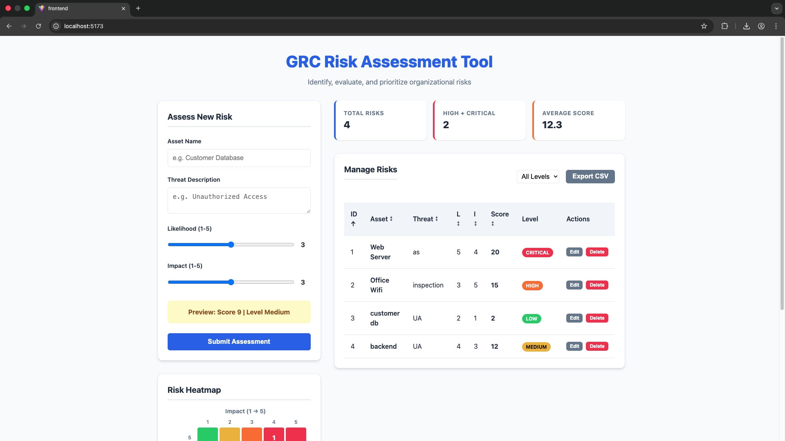

#  GRC Risk Assessment Tool

##  Live Demo
**Frontend**: [https://grc-filter-task-chandril-das.vercel.app/](https://grc-filter-task-chandril-das.vercel.app/)

##  Screenshots
### Dashboard & Metrics


### Risk Heatmap


## Overview
This project is a full-stack Risk Assessment Tool built as part of the assignment to demonstrate a practical Governance, Risk, and Compliance (GRC) use case.
The application allows users to identify risks, calculate risk scores, classify risk levels, and visualize risks using a dashboard and a risk heatmap to support data-driven decision making.

The focus of this project is correct risk logic, clean implementation, and usability, rather than advanced UI or over-engineered architecture.

## Problem Statement
Organizations face multiple risks related to assets, threats, and vulnerabilities.
This tool helps:
- Assess risks using Likelihood × Impact
- Categorize risks into severity levels
- Maintain a risk register
- Visualize risk concentration using a heatmap

This aligns with standard GRC practices such as risk identification, assessment, monitoring, and reporting.

## Technology Stack
The project intentionally uses simple, user-friendly technologies:
- **Backend**: FastAPI (Python)
- **Database**: SQLite (local, file-based)
- **Frontend**: React (JavaScript)
- **Communication**: REST APIs (JSON)

These technologies were chosen for clarity, ease of understanding, and rapid development.

## Functional Features (As per Assignment)

### 1. Risk Input & Assessment
Users can input:
- Asset Name
- Threat Description
- Likelihood (1–5)
- Impact (1–5)

The system:
- Validates Likelihood and Impact values
- Calculates **Risk Score = Likelihood × Impact**
- Displays a real-time preview of:
  - Risk Score
  - Risk Level

### 2. Risk Classification
Risk levels are categorized as:

| Score Range | Risk Level |
| :--- | :--- |
| 1 – 5 | Low |
| 6 – 12 | Medium |
| 13 – 18 | High |
| 19 – 25 | Critical |

This classification is applied consistently across the dashboard and heatmap.

### 3. Backend APIs
The FastAPI backend provides APIs to:
- Submit a new risk assessment
- Retrieve all risk records
- Filter risks by risk level

Each stored risk includes: Asset, Threat, Likelihood, Impact, Risk Score, and Risk Level. Data is stored persistently using SQLite.

### 4. Risk Dashboard
The dashboard provides:
- A Risk Register table showing all assessed risks
- Columns: ID, Asset, Threat, Likelihood, Impact, Score, Level
- Sorting by score
- Filtering by risk level
- Actions such as edit and delete

This allows continuous monitoring and management of risks.

### 5. Risk Summary Metrics
At the top of the dashboard, the application displays:
- Total number of risks
- Count of High + Critical risks
- Average risk score

These metrics provide a quick overview of the organization’s overall risk posture.

### 6. Risk Heatmap Visualization
A 5 × 5 Risk Heatmap is implemented to visually represent risk concentration.
- **X-axis**: Impact (1 → 5)
- **Y-axis**: Likelihood (5 → 1)
- Each cell represents a Likelihood–Impact combination
- Cells display the count of risks
- Color-coded based on severity:
  - Green → Low
  - Yellow → Medium
  - Orange → High
  - Red → Critical

The heatmap helps identify high-risk areas that require immediate attention.

## Project Structure
```text
project-root/
├── backend/
│   ├── app.py
│   ├── requirements.txt
│   └── risks.db
├── frontend/
│   ├── src/
│   │   ├── App.jsx
│   │   ├── RiskForm.jsx
│   │   ├── Dashboard.jsx
│   │   └── Heatmap.jsx
│   └── package.json
└── README.md
```

## How to Run the Project

### Backend
```bash
cd backend
pip install -r requirements.txt
python3 app.py
```
Backend runs on: `http://localhost:8000`

### Frontend
```bash
cd frontend
npm install
npm run dev
```
Frontend runs on: `http://localhost:5173`

## Deployment

### Backend (Render)
The backend is deployed as a **Web Service** on Render.
- **Root Directory**: `backend`
- **Build Command**: `pip install -r requirements.txt`
- **Start Command**: `uvicorn app:app --host 0.0.0.0 --port 10000`

### Frontend (Vercel)
The frontend is deployed as a **Static Site** on Vercel.
- **Root Directory**: `frontend`
- **Framework Preset**: `Vite`
- **Build Command**: `npm run build`
- **Output Directory**: `dist`
- **Environment Variables**: `VITE_API_URL` pointing to the Render backend URL.

## Assumptions & Limitations
- The application is deployed for demonstration purposes.
- No authentication or user roles are implemented
- SQLite is used for simplicity and local storage (Note: Data on Render free tier is ephemeral and may reset on restarts).
- The application is intended for demonstration purposes, not production use
- UI focuses on clarity over design aesthetics

## GRC Relevance
This tool aligns with GRC principles by:
- Identifying and assessing risks
- Maintaining a structured risk register
- Supporting monitoring through dashboards
- Enabling informed decision-making via visual analysis

## Development Notes & Challenges

###  Challenges Faced
- **Real-time Heatmap Sync**: Ensuring the 5x5 grid accurately reflected new risk entries without manual refreshes. This was handled by centralizing state in `App.jsx` and passing a refresh callback to the form.
- **Async API Synchronization**: Managed complex asynchronous states using `useEffect` and `loading` flags to prevent race conditions during data fetching and filtering.
- **Dynamic Grid Alignment**: Reversing the Likelihood axis (5 at top, 1 at bottom) while maintaining a standard row-column layout required custom CSS grid logic.

###  Edge Cases Handled
- **Boundary Validation**: Form prevents Likelihood/Impact values outside the 1–5 range.
- **Empty States**: Both the Risk Register and Heatmap display graceful placeholders when no data is available.
- **Persistence**: Using SQLite ensures that risks aren't lost when the development server restarts (local).
- **ID Sequence**: Implemented a "virtual ID" in the dashboard so that if a risk is deleted, the table IDs remain sequential (1, 2, 3...) for user clarity.

###  Bonus Features
- **CSV Export**: Added a one-click export to download the current risk register for external analysis.
- **Mitigation Hints**: Automatically provides NIST-aligned strategy suggestions based on the calculated risk level.
- **Responsive Layout**: Designed a layout that gracefully collapses into a single column on mobile devices.

## Conclusion
The Risk Assessment Tool successfully fulfills all assignment deliverables by providing:
- Correct risk calculations
- Persistent data storage
- A functional dashboard
- Visual risk analysis through a heatmap

The project demonstrates a practical understanding of risk modeling, full-stack development, and data-driven decision support.
